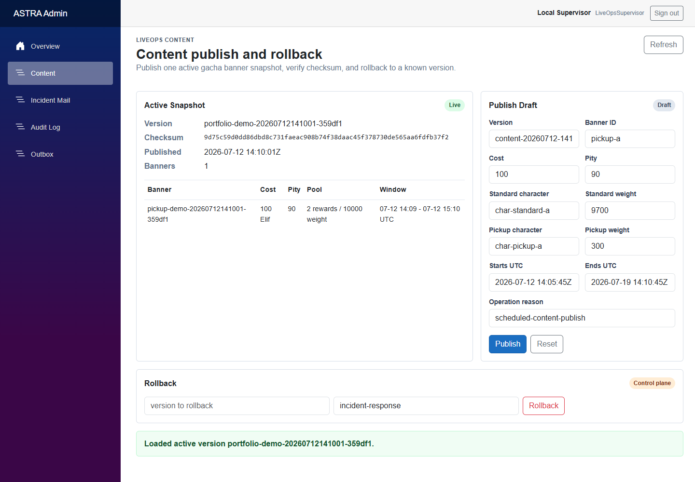
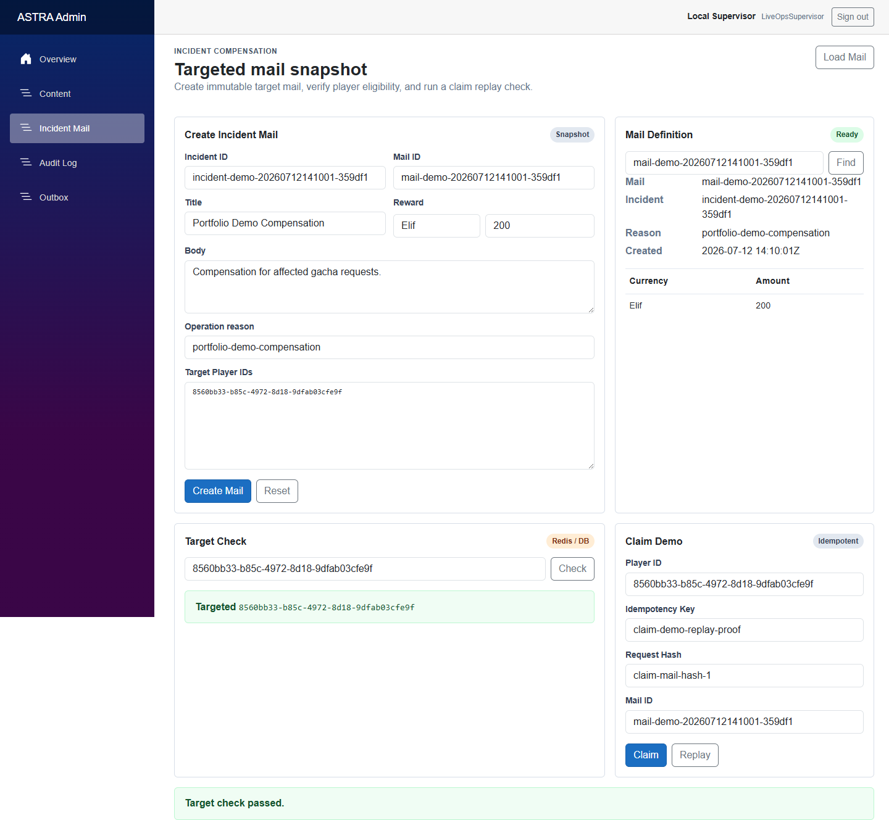
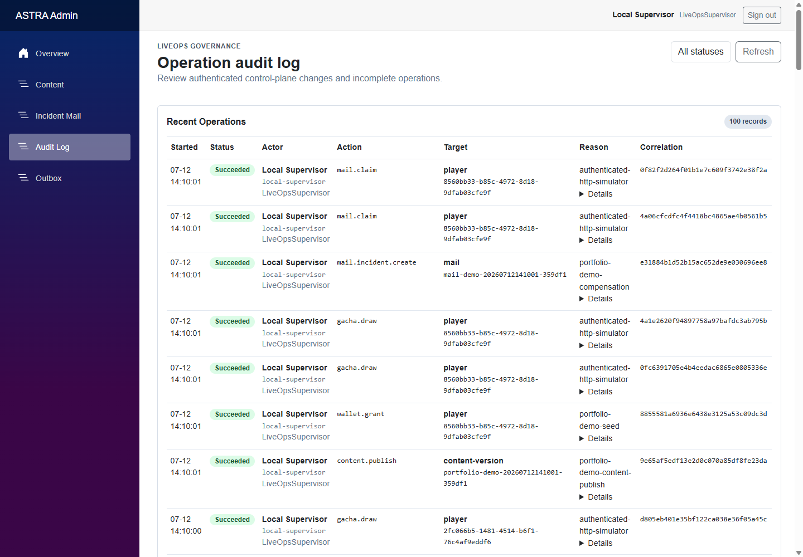
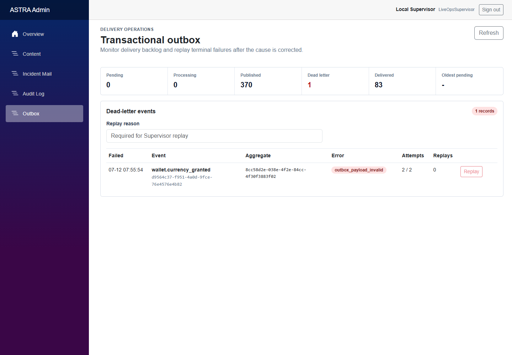
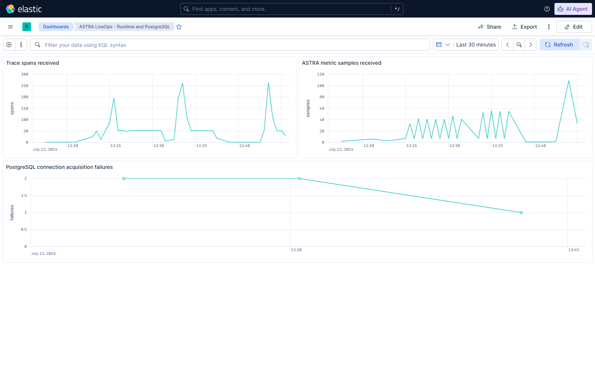
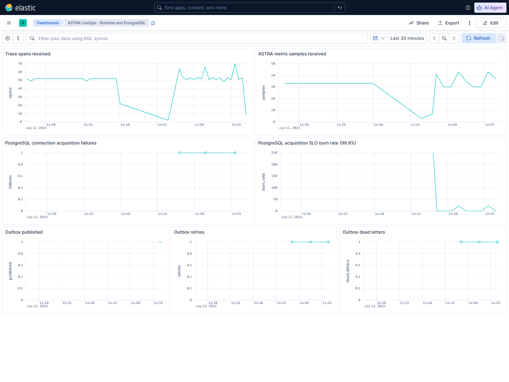

# ASTRA LiveOps Server

트릭컬 리바이브 같은 수집형 RPG의 LiveOps 문제를 기준으로 구현한 .NET 10 / Microsoft Orleans 서버.

## 운영 화면

| 콘텐츠 배포와 롤백 | 사고 대상자 보상 |
|---|---|
| [](output/playwright/01-content-ops.png) | [](output/playwright/02-incident-mail.png) |
| **운영 감사 로그** | **Outbox 운영** |
| [](output/playwright/03-audit-log.png) | [](output/playwright/04-outbox-operations.png) |

## 검토 순서

1. [포트폴리오 PDF](docs/portfolio/ASTRA_LiveOps_Portfolio.pdf)에서 문제 정의와 검증 결과를 확인한다.
2. 아래 `핵심 구현 범위`와 `현재 구현`에서 코드 범위를 확인한다.
3. `pwsh -File scripts/demo/Run-PortfolioDemo.ps1`로 핵심 시나리오를 재현한다.
4. [데모 실행 결과](output/demo/portfolio-demo-summary.md)와 [화면 증빙](output/playwright/README.md)을 확인한다.

## 핵심 구현 범위

- 가챠, 천장, 재화와 인벤토리의 트랜잭션 정합성
- 요청 `PENDING` row 없이 완료 결과를 재사용하는 멱등성
- 사고 영향 대상 snapshot과 대상자 보상 우편
- Blazor 기반 LiveOps 운영 도구
- Orleans Grain을 직접 호출하는 TCP + Protobuf Gateway
- PostgreSQL source of truth와 Redis 조회 가속

## 솔루션 구조

```text
src/
  Astra.Api             HTTP API
  Astra.TcpGateway      TCP + Protobuf gateway
  Astra.Silo            Orleans silo host
  Astra.Admin           Blazor LiveOps admin
  Astra.Worker          Outbox and operations worker
  Astra.Contracts       Shared contracts
  Astra.Domain          Domain model and command rules
  Astra.Infrastructure  PostgreSQL, Redis, persistence adapters
tests/
  Astra.UnitTests
  Astra.IntegrationTests
  Astra.ConcurrencyTests
  Astra.FailureTests
deploy/
  docker-compose.yml
  helm/astra-liveops
  terraform
  pulumi
Dockerfile              Multi-target production images
.github/workflows/ci.yml
```

## 로컬 빌드

```powershell
dotnet build Astra.LiveOps.slnx
```

Docker Compose 서비스는 profile 단위로 분리한다. 검증에 필요한 profile만 실행하며 관측성 데이터는 제한된 tmpfs에 저장한다.

## 통합 데모

다음 한 명령으로 가챠 멱등성, 사고 보상, 감사/Outbox와 HTTP/TCP replay 시나리오를 실행한다.

```powershell
pwsh -File scripts/demo/Run-PortfolioDemo.ps1
```

최신 실행 증빙은 `output/demo`에 저장한다. 실행 및 디스크 정책은 `docs/demo/PORTFOLIO_DEMO.md`에 정리한다.

## 현재 구현

- PlayerAccountGrain 계약과 구현
- 재화 지급/차감 command processor
- 요청 `PENDING` row 없는 idempotency replay
- TTL 내 동일 response envelope replay와 key 재사용 전 lazy cleanup
- 초기 테스트용 in-memory transaction store
- PostgreSQL transaction store와 schema
- immutable content snapshot과 active version 원자적 publish/rollback
- PostgreSQL LISTEN/NOTIFY 및 주기적 reconciliation으로 동기화하는 Silo-local ActiveContentCache
- active content version, checksum, 비용과 가중치 보상표를 사용하는 가챠 처리
- 천장 보장/초기화, 중복 캐릭터 변환, 인벤토리 갱신과 이력을 묶은 단일 transaction
- Incident Mail 대상 snapshot과 멱등 수령
- 사고 보상 자격 확인용 Redis membership cache
- Redis command/connection 장애 시 PostgreSQL fallback
- Incident Mail 생성, 대상 확인과 claim replay를 지원하는 Blazor Admin
- TCP + Protobuf v1 framing, 서명된 session binding과 Orleans Grain 직접 호출
- 동일 request hash와 idempotency key를 사용하는 HTTP/TCP 교차 replay
- 로컬 HMAC 개발 토큰과 외부 OIDC authority를 지원하는 JWT Bearer LiveOps RBAC
- OIDC code flow + PKCE BFF와 서버 측 API access token session
- 인증된 작업자와 intent-first lifecycle을 기록하는 PostgreSQL 운영 감사
- RFC 7807 ProblemDetails, 입력 제한 검증과 actor 단위 역할별 rate limit
- Transactional Outbox와 PostgreSQL lease/retry Worker
- projection 정제, terminal dead-letter와 감사된 Supervisor replay를 지원하는 멱등 consumer
- 만료된 published event와 delivery projection을 원자적으로 제거하는 retention cleanup
- grace period, `SKIP LOCKED` batch와 query timeout을 적용한 만료 idempotency 정리
- 서비스별 PostgreSQL pool budget, wait/command timeout과 포화 회복 테스트
- payload와 idempotency key를 노출하지 않는 Blazor Outbox 운영 화면
- OTel HTTP/TCP/PostgreSQL trace, Npgsql pool metric과 connection 획득 metric
- PostgreSQL 포화 burn rate와 Outbox publish/retry/dead-letter 장애 증빙
- low-cardinality outcome 기반 TCP 요청 수와 응답 완료 latency metric
- profile 기반 EDOT -> Elasticsearch -> Kibana pipeline, Dashboard as Code와 alert probe
- API, Silo와 Worker의 OpenTelemetry console/OTLP exporter
- PostgreSQL Outbox event부터 published 상태까지의 Worker E2E 검증
- consumer commit과 Outbox publish 사이 crash window의 OS hard-kill 복구 테스트
- 재화와 멱등성의 동시성/장애 테스트
- 가챠 차감 이후 오류가 부분 상태를 남기지 않는 failure injection
- 실제 PostgreSQL service를 사용하는 GitHub Actions build/test
- 고정된 upstream schema migration 기반 PostgreSQL Orleans ADO.NET membership
- 2-Silo membership과 HTTP/TCP Grain RPC 검증
- API, Admin, Silo, TCP Gateway와 Worker의 non-root multi-target Docker image
- resource limit, probe, Secret reference, PDB와 migration hook을 포함한 Helm chart
- private AKS, ACR, VNet, Log Analytics와 PostgreSQL을 정의하는 Terraform
- Helm application release만 소유하는 Pulumi C# program
- Docker, Helm, Terraform과 Pulumi의 GitHub Actions 배포 구성 검증

`InMemory` 저장소는 단일 Silo 개발과 단위 테스트에만 사용한다. Multi-Silo 실행 경로는 PostgreSQL mode다.
콘텐츠 lifecycle과 장애 동작은 `docs/content/CONTENT_LIFECYCLE.md`에 정리한다.
LiveOps 인증, route 권한과 감사 정책은 `docs/security/LIVEOPS_AUTH_AUDIT.md`에 정리한다.
HTTP 오류, 검증과 요청 제한 contract는 `docs/api/API_BOUNDARY.md`에 정리한다.
Outbox 전달, crash recovery, dead-letter와 replay 정책은 `docs/operations/OUTBOX_DELIVERY.md`에 정리한다.
영속 데이터 TTL과 DB 부하 제한은 `docs/persistence/RETENTION.md`에 정리한다.
PostgreSQL pool budget, SLO와 alert 기준은 `docs/operations/POSTGRES_POOL_SLO.md`에 정리한다.
Elastic/EDOT 실행 범위와 E2E 검증은 `docs/operations/OBSERVABILITY.md`에 정리한다.
Container, Kubernetes, Terraform, Pulumi와 배포 책임은 `docs/deployment/DEPLOYMENT.md`에 정리한다.

## 관측성 화면

| Kibana 관측성 Dashboard | 운영 상태 Dashboard |
|---|---|
| [](output/playwright/astra-observability-dashboard.png) | [](output/playwright/astra-operational-dashboard.png) |

## 배포 구성 검증

```powershell
docker build --check --target api .
helm lint deploy/helm/astra-liveops
helm template astra deploy/helm/astra-liveops --namespace astra
terraform -chdir=deploy/terraform init -backend=false
terraform -chdir=deploy/terraform validate
dotnet build deploy/pulumi/Astra.LiveOps.Deploy.csproj -c Release
```

CI는 Docker target 5개를 모두 build한다. 로컬에서는 Docker Desktop 디스크 증가를 막기 위해 기본적으로 `docker build --check`를 사용한다.

## PostgreSQL 통합 검증

PostgreSQL만 내려받아 실행한다. 이 검증에서는 observability profile을 활성화하지 않는다.

```powershell
docker compose -f deploy/docker-compose.yml --profile core up -d postgres
$env:ASTRA_RUN_POSTGRES_TESTS='1'
dotnet test tests/Astra.IntegrationTests/Astra.IntegrationTests.csproj --filter Postgres
```

Named volume을 삭제하지 않고 container만 중지한다.

```powershell
docker compose -f deploy/docker-compose.yml stop postgres
```

## TCP Gateway E2E 검증

`Astra.Silo`, `Astra.Api`, `Astra.TcpGateway`를 실행한 뒤 테스트한다.

```powershell
$env:ASTRA_RUN_TCP_E2E='1'
dotnet test tests/Astra.IntegrationTests/Astra.IntegrationTests.csproj --filter TcpGatewayEndToEndTests
```

테스트는 HTTP로 콘텐츠와 플레이어 상태를 준비하고 TCP 가챠, 재연결, 동일 idempotency key replay와 HTTP/TCP wallet 일치를 검증한다. Wire protocol은 `docs/tcp/PROTOCOL.md`에 정리한다.
