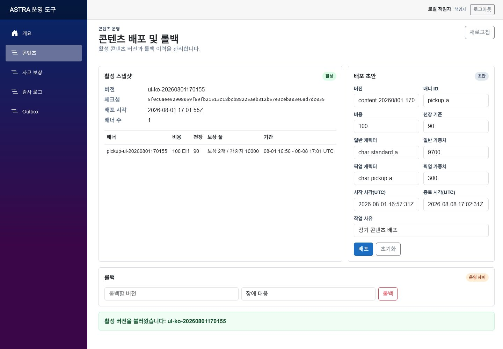
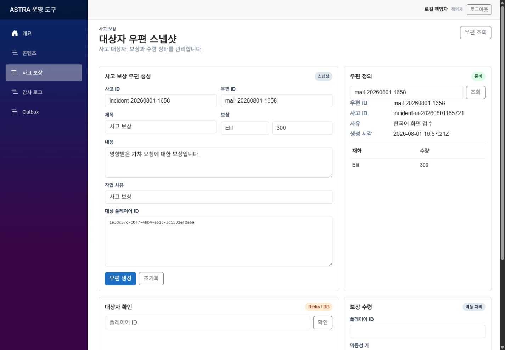
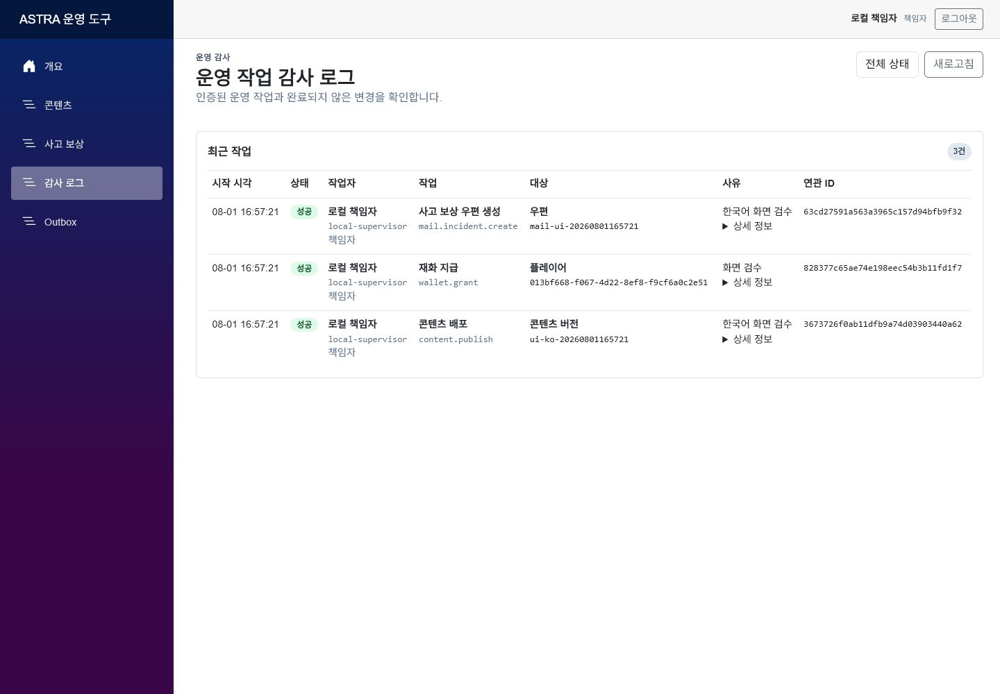
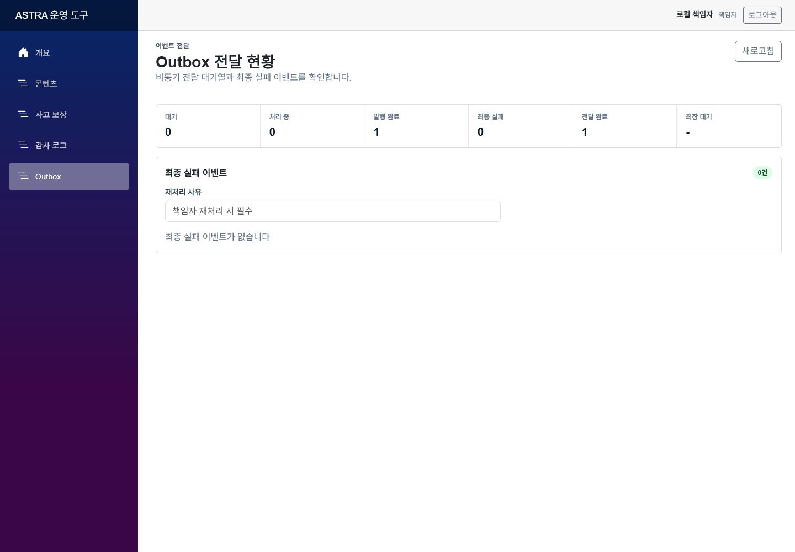

# ASTRA LiveOps Server

.NET 10과 Microsoft Orleans로 구현한 수집형 RPG LiveOps 서버입니다. 네트워크 재시도와 동시 요청에서도 가챠, 재화, 천장 상태를 일관되게 유지하고, 콘텐츠 배포 사고의 추적, 롤백, 대상자 보상까지 운영 화면과 장애 테스트로 검증합니다.

[](https://github.com/hannip0461/ASTRA-LiveOps-Server/actions/workflows/ci.yml)

## 주요 화면

### 콘텐츠 배포 및 롤백

[](output/screenshots/01-content-ops.png)

**운영 흐름:** 콘텐츠 배포 및 롤백 → 영향 대상 확정 → 사고 보상 우편 → 감사 로그 및 Outbox → 지표와 경보 확인

## 프로젝트 개요

수집형 RPG에서는 네트워크 재시도, 동시 명령과 콘텐츠 운영 실수가 재화와 보상 오류로 이어질 수 있습니다. ASTRA는 플레이어별 명령 직렬화, PostgreSQL 원자적 트랜잭션과 운영 복구 절차를 하나의 실행 가능한 서버로 구성합니다.

| 영역 | 구현 결과 |
|---|---|
| 플레이어 명령 | PlayerAccountGrain 기반 직렬화와 HTTP/TCP 공통 command 처리 |
| 영속 정합성 | PostgreSQL transaction, ledger, audit와 completed response replay |
| 운영 복구 | immutable content snapshot, rollback, 영향 대상 snapshot과 Incident Mail |
| 운영 가시성 | Blazor Admin, Transactional Outbox, OpenTelemetry와 Kibana Dashboard |
| 검증 | 전체 테스트 108건 통과 (단위 76, 동시성 1, 실패 주입 2, 통합 29). 실제 PostgreSQL, HTTP/TCP E2E 포함 |

## 핵심 시나리오

### 가챠 정합성

동일한 `Idempotency-Key` 요청은 저장된 응답을 재사용한다. 재화 차감, 보상 지급, 중복 캐릭터 변환, 천장 갱신, 원장, 감사 로그와 Outbox event를 하나의 PostgreSQL transaction에서 commit한다.

### 운영 사고 복구

배포된 콘텐츠의 version과 checksum을 기록한다. 잘못된 설정은 이전 snapshot으로 rollback하고, 영향 대상자를 확정한 뒤 Incident Mail을 통해 중복 없이 보상한다.

## 운영 화면 상세

### 사고 보상 우편

[](output/screenshots/02-incident-mail.png)

### 운영 작업 감사 로그

[](output/screenshots/03-audit-log.png)

### Outbox 전달 현황

[](output/screenshots/04-outbox-operations.png)

### 운영 상태 대시보드

[](output/screenshots/astra-operational-dashboard.png)

### Kibana 관측 대시보드

[](output/screenshots/astra-observability-dashboard.png)

## 시스템 구성

| 구성요소 | 책임 |
|---|---|
| ASP.NET Core API | 인증, 권한, 입력 검증과 HTTP command 경계 |
| TCP + Protobuf Gateway | session/framing 검증과 Orleans Grain 직접 호출 |
| Orleans Silo | 플레이어별 명령 직렬화와 콘텐츠 control plane |
| PostgreSQL | 상태, 원장, 감사, 멱등 응답, 콘텐츠와 Outbox의 source of truth |
| Redis | 사고 보상 대상 membership과 짧은 TTL 조회 가속 |
| Blazor Admin | 콘텐츠 배포 및 롤백, 사고 보상 우편, 감사 로그와 Outbox 운영 |
| Worker | Outbox lease/retry/dead-letter와 retention cleanup |
| OpenTelemetry / Elastic | API, TCP, Grain, DB와 Worker trace, metric, alert |

## 구현 상세

### 상태와 정합성

- PlayerAccountGrain의 플레이어별 command 직렬화
- 가챠, 재화, inventory, pity와 ledger의 단일 PostgreSQL transaction
- 요청 hash 검증, completed response 저장과 TTL 기반 idempotency replay
- commit 전 장애 rollback과 commit 후 응답 장애 replay 테스트
- hot state와 대용량 cold state 분리

### LiveOps와 사고 복구

- immutable content snapshot과 active version publish/rollback
- Silo-local ActiveContentCache, PostgreSQL LISTEN/NOTIFY와 주기적 reconciliation
- 사고 영향 대상 snapshot, Redis membership cache와 PostgreSQL fallback
- 멱등 Incident Mail claim과 운영 audit trail
- Blazor 기반 콘텐츠, 보상, 감사, Outbox 운영 화면

### 통신과 보안

- ASP.NET Core HTTP와 TCP + Protobuf의 공통 command contract
- TCP framing, signed session binding과 cross-transport replay
- JWT Bearer RBAC와 외부 OIDC authority 검증
- Blazor Admin OIDC code flow + PKCE BFF
- RFC 7807 ProblemDetails, 입력 제한과 actor 단위 rate limit

### 비동기 처리와 관측성

- Transactional Outbox, PostgreSQL lease/retry와 terminal dead-letter
- 감사된 Supervisor replay와 멱등 operational consumer
- OTel HTTP/TCP/PostgreSQL trace와 low-cardinality metric
- PostgreSQL pool saturation, Outbox failure와 alert 재현
- EDOT -> Elasticsearch -> Kibana Dashboard as Code

### 배포와 검증

- 실제 PostgreSQL을 사용하는 GitHub Actions build/test
- PostgreSQL ADO.NET membership 기반 2-Silo 검증
- API, Admin, Silo, TCP Gateway와 Worker의 non-root Docker image
- Helm resource/probe/PDB/migration hook, Terraform Azure foundation, Pulumi Helm release
- 동시성, failure injection, hard-kill crash window와 HTTP/TCP E2E 테스트

## 솔루션 구조

```text
src/
  Astra.Api             HTTP API
  Astra.TcpGateway      TCP + Protobuf gateway
  Astra.Silo            Orleans silo host
  Astra.Admin           Blazor LiveOps admin
  Astra.Worker          Outbox and operations worker
  Astra.Contracts       Shared contracts
  Astra.Domain          Domain model and command rules
  Astra.Infrastructure  PostgreSQL, Redis, persistence adapters
tests/
  Astra.UnitTests
  Astra.IntegrationTests
  Astra.ConcurrencyTests
  Astra.FailureTests
deploy/
  docker-compose.yml
  helm/astra-liveops
  terraform
  pulumi
Dockerfile              Multi-target production images
.github/workflows/ci.yml
```

## 실행과 검증

<details>
<summary><b>로컬 빌드와 통합 데모</b></summary>

```powershell
dotnet build Astra.LiveOps.slnx
pwsh -File scripts/demo/Run-IntegratedDemo.ps1
```

데모는 가챠 replay, 콘텐츠 사고 대상 snapshot, Incident Mail 보상, audit/Outbox와 HTTP/TCP replay를 검증하고 `output/demo`에 실행 결과를 남긴다.

</details>

<details>
<summary><b>PostgreSQL 통합 검증</b></summary>

```powershell
docker compose -f deploy/docker-compose.yml --profile core up -d postgres
$env:ASTRA_RUN_POSTGRES_TESTS='1'
dotnet test tests/Astra.IntegrationTests/Astra.IntegrationTests.csproj --filter Postgres
docker compose -f deploy/docker-compose.yml stop postgres
```

</details>

<details>
<summary><b>TCP Gateway E2E</b></summary>

`Astra.Silo`, `Astra.Api`, `Astra.TcpGateway`를 실행한 뒤 테스트한다.

```powershell
$env:ASTRA_RUN_TCP_E2E='1'
dotnet test tests/Astra.IntegrationTests/Astra.IntegrationTests.csproj --filter TcpGatewayEndToEndTests
```

</details>

<details>
<summary><b>배포 구성 검증</b></summary>

```powershell
docker build --check --target api .
helm lint deploy/helm/astra-liveops
helm template astra deploy/helm/astra-liveops --namespace astra
terraform -chdir=deploy/terraform init -backend=false
terraform -chdir=deploy/terraform validate
dotnet build deploy/pulumi/Astra.LiveOps.Deploy.csproj -c Release
```

</details>

## 산출물 모음

| 산출물 | 내용 |
|---|---|
| [OpenAPI 문서](openapi.json) | HTTP 엔드포인트 19개와 스키마 14개의 OpenAPI 3.1 계약 |
| [프로젝트 종합 문서](docs/project/ASTRA_LiveOps_Project_Overview.pdf) | 문제 정의, 설계 결정, 파이프라인과 검증 결과 |
| [아키텍처 도식 모음](docs/project/ASTRA_LiveOps_Architecture_Diagrams.pdf) | 런타임, transaction, 콘텐츠, 복구, Outbox와 배포 흐름 |
| [통합 데모 결과](output/demo/integrated-demo-summary.md) | 실행 시나리오와 검증 결과 요약 |
| [데모 결과 JSON](output/demo/integrated-demo-evidence.json) | 자동 검증 가능한 실행 결과 |
| [운영 화면 원본](output/screenshots/README.md) | Admin 및 Kibana 화면 6종 |
| [GitHub Actions CI](https://github.com/hannip0461/ASTRA-LiveOps-Server/actions/workflows/ci.yml) | build, test, E2E, IaC 검증과 Docker image 발행 |
| [GHCR Docker images](https://github.com/hannip0461?tab=packages) | API, Admin, Silo, TCP Gateway, Worker image |

### Docker 이미지

- [`api`](https://github.com/hannip0461/ASTRA-LiveOps-Server/pkgs/container/astra-liveops-api): `ghcr.io/hannip0461/astra-liveops-api:latest`
- [`admin`](https://github.com/hannip0461/ASTRA-LiveOps-Server/pkgs/container/astra-liveops-admin): `ghcr.io/hannip0461/astra-liveops-admin:latest`
- [`silo`](https://github.com/hannip0461/ASTRA-LiveOps-Server/pkgs/container/astra-liveops-silo): `ghcr.io/hannip0461/astra-liveops-silo:latest`
- [`tcp-gateway`](https://github.com/hannip0461/ASTRA-LiveOps-Server/pkgs/container/astra-liveops-tcp-gateway): `ghcr.io/hannip0461/astra-liveops-tcp-gateway:latest`
- [`worker`](https://github.com/hannip0461/ASTRA-LiveOps-Server/pkgs/container/astra-liveops-worker): `ghcr.io/hannip0461/astra-liveops-worker:latest`

세부 운영 정책은 `docs/content`, `docs/security`, `docs/api`, `docs/operations`, `docs/persistence`, `docs/tcp`, `docs/deployment`에 정리한다.
